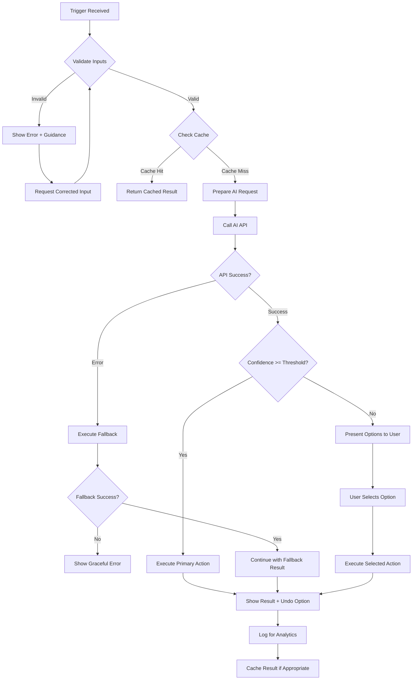
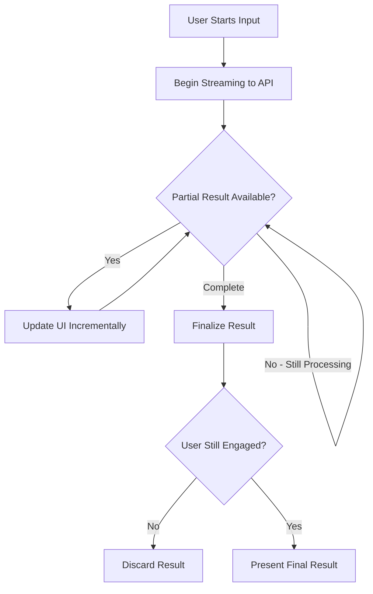
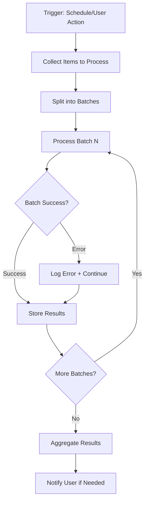

# MVP Technical Specification Framework

**Version**: 1.0
**Created**: April 8, 2026
**Author**: Theo-Brown (Tech Specs Team)
**Purpose**: Reusable framework for creating implementation-ready AI-native app specifications

---

## Table of Contents

1. [System Prompt Engineering Framework](#1-system-prompt-engineering-framework)
2. [AI Feature Logic Flow Templates](#2-ai-feature-logic-flow-templates)
3. [MVP Architecture Patterns](#3-mvp-architecture-patterns)
4. [Feature Prioritization Framework](#4-feature-prioritization-framework)
5. [Technical Specification Template](#5-technical-specification-template)
6. [Research Findings](#6-research-findings)

---

## 1. System Prompt Engineering Framework

### 1.1 Core Template Structure

Every AI feature system prompt should follow this structure:

```markdown
# Role Definition
You are [role] that [primary function] for [target user].

# Context
The user is [context description]. Their goal is to [specific goal].
Current situation: [relevant state/data].

# Capabilities
You can:
- [Capability 1 with scope]
- [Capability 2 with scope]
- [Capability 3 with scope]

# Constraints
You must NOT:
- [Hard constraint 1: e.g., never recommend unsafe options]
- [Hard constraint 2: e.g., never fabricate data]
- [Hard constraint 3: e.g., stay within domain boundaries]

You should AVOID:
- [Soft constraint 1: e.g., overly complex suggestions]
- [Soft constraint 2: e.g., jargon the user won't understand]

# Output Format
Always respond with valid JSON:
{
  "action": "[action_type]",
  "data": {
    // Structured output specific to feature
  },
  "confidence": 0.0-1.0,
  "reasoning": "[brief explanation for transparency]",
  "fallback_prompt": "[if confidence < threshold, ask user this]"
}

# Examples
## Example 1: [Scenario Name]
Input: [user input or context]
Output: [expected JSON response]

## Example 2: [Edge Case Scenario]
Input: [tricky input]
Output: [how to handle gracefully]

## Example 3: [Error Scenario]
Input: [invalid/unclear input]
Output: [recovery response with fallback_prompt]
```

### 1.2 Prompt Categories

#### Category A: Input Processing
**Purpose**: Transform unstructured input (photo, voice, text) into structured data

```markdown
# Role Definition
You are a [domain] data extraction specialist that converts [input type] into structured, actionable data.

# Input Types Handled
- Photos: [what to extract - objects, text, faces, context]
- Voice: [transcription expectations, language handling]
- Free text: [parsing rules, entity extraction]

# Output Schema
{
  "extracted_entities": [
    {"type": "[entity_type]", "value": "[extracted_value]", "confidence": 0.0-1.0}
  ],
  "structured_data": {
    // Domain-specific structured format
  },
  "missing_required": ["[field_name]"],
  "clarification_needed": "[question if ambiguous]"
}

# Quality Thresholds
- Only include entities with confidence > 0.7
- Flag for human review if overall confidence < 0.6
- Request clarification for ambiguous entities
```

#### Category B: Decision Making
**Purpose**: Analyze context and generate recommendations

```markdown
# Role Definition
You are a [domain] decision assistant that analyzes [context type] to recommend [decision type].

# Decision Criteria
Prioritize by (in order):
1. [Primary criterion - e.g., user safety]
2. [Secondary criterion - e.g., user preference history]
3. [Tertiary criterion - e.g., cost efficiency]

# Context Inputs
Required:
- [Input 1]: [description and format]
- [Input 2]: [description and format]

Optional (improves quality):
- [Optional Input 1]: [how it helps]
- [Optional Input 2]: [how it helps]

# Output Schema
{
  "recommendation": {
    "primary": "[top recommendation]",
    "alternatives": ["[alt 1]", "[alt 2]"],
    "reasoning": "[why this recommendation]"
  },
  "confidence": 0.0-1.0,
  "factors_considered": ["[factor 1]", "[factor 2]"],
  "user_confirmation_needed": true/false,
  "confirmation_prompt": "[question if needed]"
}
```

#### Category C: Content Generation
**Purpose**: Create content from brief/parameters

```markdown
# Role Definition
You are a [domain] content creator that generates [content type] based on [input brief].

# Content Guidelines
Tone: [formal/casual/playful/professional]
Length: [constraints - words, sentences, etc.]
Style: [specific style guidelines]
Brand voice: [if applicable]

# Input Brief Format
{
  "topic": "[main subject]",
  "audience": "[target audience]",
  "key_points": ["[point 1]", "[point 2]"],
  "constraints": ["[constraint 1]", "[constraint 2]"]
}

# Output Schema
{
  "content": "[generated content]",
  "variations": ["[variation 1]", "[variation 2]"],
  "metadata": {
    "word_count": 0,
    "reading_time_seconds": 0,
    "tone_score": "[analyzed tone]"
  },
  "confidence": 0.0-1.0,
  "edit_suggestions": ["[suggestion if confidence < 0.9]"]
}
```

#### Category D: Planning & Optimization
**Purpose**: Create optimized plans from constraints

```markdown
# Role Definition
You are a [domain] planning specialist that creates optimal [plan type] given [constraint type].

# Optimization Objectives
Primary: [main objective - e.g., minimize time]
Secondary: [secondary objective - e.g., maximize coverage]
Constraints: [hard limits - e.g., budget, time, resources]

# Input Format
{
  "goals": ["[goal 1]", "[goal 2]"],
  "constraints": {
    "hard": ["[must satisfy]"],
    "soft": ["[prefer to satisfy]"]
  },
  "resources": {
    "[resource_type]": "[available amount]"
  },
  "preferences": ["[user preferences]"]
}

# Output Schema
{
  "plan": {
    "steps": [
      {
        "order": 1,
        "action": "[what to do]",
        "duration": "[time estimate]",
        "resources_required": ["[resource]"],
        "dependencies": ["[step_id]"]
      }
    ],
    "total_duration": "[estimate]",
    "resource_utilization": {}
  },
  "alternatives": [
    {"name": "[plan B]", "tradeoffs": "[what's different]"}
  ],
  "confidence": 0.0-1.0,
  "risks": ["[potential issue]"],
  "user_decisions_needed": ["[decision point]"]
}
```

### 1.3 Prompt Engineering Best Practices

#### Structure & Clarity
- **Be specific**: "Extract restaurant names, cuisine types, and price ranges" not "Extract relevant info"
- **Use delimiters**: Separate sections with clear markers (###, ---, XML tags)
- **Order matters**: Put most important instructions first and last (primacy/recency effect)

#### Output Control
- **JSON mode**: Always request structured JSON for programmatic parsing
- **Schema enforcement**: Provide exact output schema with field descriptions
- **Confidence scores**: Always include confidence for downstream decision making

#### Few-Shot Examples
- **Minimum 3 examples**: Cover happy path, edge case, and error recovery
- **Diverse examples**: Show variety in input formats and contexts
- **Show reasoning**: Include why the output is correct in examples

#### Safety & Boundaries
- **Explicit constraints**: State what the AI must NOT do
- **Domain boundaries**: Define scope clearly to prevent hallucination
- **Fallback behavior**: Always define what to do when uncertain

#### Performance Optimization
- **Token efficiency**: Remove redundant instructions after testing
- **Cache-friendly**: Structure prompts so common parts can be cached
- **Streaming-aware**: Design outputs that work with streaming responses

---

## 2. AI Feature Logic Flow Templates

### 2.1 Standard Feature Flow Template

```markdown
## Feature: [Feature Name]

### Trigger Conditions
**User-Initiated:**
- [Action 1]: User taps [button/gesture]
- [Action 2]: User provides [input type]

**Automatic:**
- [Condition 1]: When [context condition is met]
- [Condition 2]: Time-based trigger at [frequency]

### Input Collection

| Input | Type | Required | Source | Validation |
|-------|------|----------|--------|------------|
| [Input 1] | [type] | Yes | [user/device/stored] | [rules] |
| [Input 2] | [type] | No | [source] | [rules] |

### Processing Flow



### Error Handling Matrix

| Error Type | Detection | User Message | Recovery Action |
|------------|-----------|--------------|-----------------|
| Network failure | HTTP timeout/error | "Connection issue. Tap to retry." | Retry with backoff |
| API rate limit | 429 response | "Busy right now. Try in a moment." | Queue and retry |
| Invalid input | Validation fails | "[Specific guidance]" | Re-request input |
| Low confidence | confidence < 0.6 | "I'm not sure. Did you mean...?" | Show alternatives |
| API unavailable | 5xx response | "Feature temporarily unavailable." | Use cached/fallback |

### Feedback & Learning Loop

**Implicit Feedback:**
- User accepts suggestion → Positive signal
- User modifies result → Learning opportunity
- User discards/undoes → Negative signal

**Explicit Feedback:**
- Thumbs up/down on result
- "This is wrong" correction flow
- Preference settings

**Feedback Storage:**
```json
{
  "feature": "[feature_name]",
  "input_hash": "[anonymized input signature]",
  "ai_output": "[what AI suggested]",
  "user_action": "accepted|modified|rejected",
  "user_correction": "[if modified, what user changed to]",
  "timestamp": "[ISO timestamp]"
}
```
```

### 2.2 Real-Time Processing Flow (Streaming)

For features requiring immediate feedback (voice input, live suggestions):



**Key Considerations:**
- Debounce user input (200-500ms) to avoid excessive API calls
- Show typing indicator or progress during processing
- Allow user to cancel mid-stream
- Handle partial results gracefully

### 2.3 Batch Processing Flow (Background)

For features that process multiple items or run on schedule:



**Key Considerations:**
- Process in background (don't block UI)
- Implement checkpoint/resume for large batches
- Notify user on completion via push notification
- Allow user to view progress

---

## 3. MVP Architecture Patterns

### 3.1 Option A: API-First Architecture (Recommended for MVP)

```
┌─────────────────────────────────────────────────────────────────┐
│                         CLIENT LAYER                            │
│  ┌─────────────────────────────────────────────────────────┐   │
│  │                    Mobile App (Flutter)                  │   │
│  │  ┌──────────┐  ┌──────────┐  ┌──────────┐             │   │
│  │  │    UI    │  │  State   │  │  Local   │             │   │
│  │  │  Layer   │──│Management│──│  Cache   │             │   │
│  │  └──────────┘  └──────────┘  └──────────┘             │   │
│  └─────────────────────────────────────────────────────────┘   │
└───────────────────────────────┬─────────────────────────────────┘
                                │ HTTPS
                                ▼
┌─────────────────────────────────────────────────────────────────┐
│                        BACKEND LAYER                            │
│  ┌─────────────────────────────────────────────────────────┐   │
│  │              Firebase Cloud Functions                    │   │
│  │  ┌──────────┐  ┌──────────┐  ┌──────────┐             │   │
│  │  │   API    │  │   AI     │  │  Auth    │             │   │
│  │  │ Gateway  │──│ Orchestr.│──│Middleware│             │   │
│  │  └──────────┘  └──────────┘  └──────────┘             │   │
│  └─────────────────────────────────────────────────────────┘   │
└──────────┬────────────────────┬────────────────────┬────────────┘
           │                    │                    │
           ▼                    ▼                    ▼
┌──────────────────┐  ┌──────────────────┐  ┌──────────────────┐
│    Firestore     │  │    AI APIs       │  │   Storage        │
│    Database      │  │  (OpenAI/Gemini) │  │   (Images/Files) │
└──────────────────┘  └──────────────────┘  └──────────────────┘
```

**Characteristics:**
- All AI processing happens server-side
- Client is thin - mainly UI and local caching
- Easy to update AI logic without app updates
- Centralized API key management (secure)

**Pros:**
- Fast to build and iterate
- Easy to switch AI providers
- Secure API key handling
- Works on any device (no ML requirements)
- Easier debugging (centralized logs)

**Cons:**
- Requires internet connectivity
- API costs scale with usage
- Latency dependent on network
- Server costs for Cloud Functions

**Best For:**
- MVPs and rapid prototyping
- Features requiring latest AI models
- Apps where connectivity is assumed

### 3.2 Option B: Hybrid Architecture (On-Device + Cloud)

```
┌─────────────────────────────────────────────────────────────────┐
│                         CLIENT LAYER                            │
│  ┌─────────────────────────────────────────────────────────┐   │
│  │                    Mobile App (Flutter)                  │   │
│  │  ┌──────────┐  ┌──────────┐  ┌──────────┐             │   │
│  │  │    UI    │  │  State   │  │  Local   │             │   │
│  │  │  Layer   │──│Management│──│  Cache   │             │   │
│  │  └──────────┘  └──────────┘  └──────────┘             │   │
│  │                     │                                    │   │
│  │  ┌──────────────────▼───────────────────────────────┐   │   │
│  │  │              On-Device ML Layer                   │   │   │
│  │  │  ┌──────────┐  ┌──────────┐  ┌──────────┐       │   │   │
│  │  │  │ TFLite/  │  │  Local   │  │  Quick   │       │   │   │
│  │  │  │ CoreML   │  │  LLM     │  │ Classify │       │   │   │
│  │  │  └──────────┘  └──────────┘  └──────────┘       │   │   │
│  │  └──────────────────────────────────────────────────┘   │   │
│  └─────────────────────────────────────────────────────────┘   │
└───────────────────────────────┬─────────────────────────────────┘
                                │ HTTPS (heavy tasks only)
                                ▼
┌─────────────────────────────────────────────────────────────────┐
│                    CLOUD LAYER (Heavy AI Only)                  │
│  ┌─────────────────────────────────────────────────────────┐   │
│  │              Firebase Cloud Functions                    │   │
│  │  - Complex reasoning tasks                               │   │
│  │  - Large context processing                              │   │
│  │  - Tasks requiring latest models                         │   │
│  └─────────────────────────────────────────────────────────┘   │
└─────────────────────────────────────────────────────────────────┘
```

**Task Distribution:**

| Task Type | Location | Rationale |
|-----------|----------|-----------|
| Image classification | On-device | Fast, no network needed |
| Text classification | On-device | Simple models work well |
| OCR/text extraction | On-device | Privacy, speed |
| Complex reasoning | Cloud | Requires large models |
| Content generation | Cloud | Quality requires GPT-4 class |
| Personalization | Cloud | Needs full user history |

**Pros:**
- Faster response for simple tasks
- Works offline for basic features
- Lower API costs (fewer cloud calls)
- Better privacy (data stays on device)

**Cons:**
- More complex to build and maintain
- Device limitations (memory, processing)
- Model updates require app updates
- Platform-specific ML implementations

**Best For:**
- Apps requiring offline functionality
- Privacy-sensitive applications
- High-volume, latency-sensitive features

### 3.3 Option C: Edge-First Architecture (Future)

For reference - not recommended for MVP:

```
┌─────────────────────────────────────────────────────────────────┐
│                    CLIENT (Most AI On-Device)                   │
│  ┌──────────────────────────────────────────────────────────┐  │
│  │  Local LLM (Gemma/Phi)  │  Embedding Search  │  RAG      │  │
│  └──────────────────────────────────────────────────────────┘  │
└───────────────────────────────┬─────────────────────────────────┘
                                │ Sync only
                                ▼
┌─────────────────────────────────────────────────────────────────┐
│              CLOUD (Data Sync + Model Updates Only)             │
└─────────────────────────────────────────────────────────────────┘
```

Reserved for production scale when on-device LLMs mature.

### 3.4 Architecture Decision Matrix

| Factor | API-First | Hybrid | Edge-First |
|--------|-----------|--------|------------|
| Time to MVP | 2-4 weeks | 6-10 weeks | 12+ weeks |
| Development complexity | Low | Medium | High |
| API costs (1000 DAU) | ~$100-500/mo | ~$30-150/mo | ~$10/mo |
| Latency (typical) | 500-2000ms | 100-500ms | 50-200ms |
| Offline capability | None | Partial | Full |
| Model flexibility | High | Medium | Low |
| Privacy | Server-side | Mixed | Client-side |

**Recommendation for MVP: Option A (API-First)**

Rationale:
1. Fastest path to market validation
2. Easy to iterate on AI features
3. Can migrate to Hybrid once product-market fit is proven
4. Lower initial development cost

---

## 4. Feature Prioritization Framework

### 4.1 Priority Definitions

| Priority | Name | Definition | MVP Inclusion |
|----------|------|------------|---------------|
| P0 | Launch Blocker | App cannot launch without this | Must have |
| P1 | Core Experience | Significantly degrades experience if missing | Should have |
| P2 | Enhancement | Improves experience but not essential | Nice to have |
| P3 | Future | Planned for later releases | Out of scope |

### 4.2 Prioritization Criteria

Score each feature 1-5 on these dimensions:

| Criterion | Weight | 1 (Low) | 5 (High) |
|-----------|--------|---------|----------|
| User Value | 3x | Nice to have | Core need |
| Differentiation | 2x | Commodity | Unique advantage |
| Technical Feasibility | 2x | Very complex | Straightforward |
| AI Dependency | 1x | Works without AI | AI is essential |
| Risk | 1x | Many unknowns | Well understood |

**Priority Score Formula:**
```
Score = (UserValue × 3) + (Differentiation × 2) + (Feasibility × 2) + (AIDependency × 1) + (Risk × 1)
Max Score = 45
```

**Priority Thresholds:**
- P0: Score >= 36 AND (UserValue = 5 OR Differentiation = 5)
- P1: Score >= 27
- P2: Score >= 18
- P3: Score < 18

### 4.3 MVP Scope Template

```markdown
## [App Name] MVP Feature Scope

### P0 - Launch Blockers (Must Ship)

| Feature | Score | AI Required | Effort | Notes |
|---------|-------|-------------|--------|-------|
| [Hero AI Feature] | 42 | Yes | L | Core differentiator |
| [User Auth] | 38 | No | M | Required for personalization |
| [Core Data Model] | 40 | No | M | Foundation for everything |
| [Minimum UI] | 36 | No | M | Core user flows only |

### P1 - Core Experience (Target for Launch)

| Feature | Score | AI Required | Effort | Notes |
|---------|-------|-------------|--------|-------|
| [Secondary AI Feature] | 32 | Yes | M | Enhances core loop |
| [Settings/Preferences] | 28 | No | S | User customization |
| [Error Recovery] | 30 | No | S | Graceful degradation |

### P2 - Enhancements (If Time Permits)

| Feature | Score | AI Required | Effort | Notes |
|---------|-------|-------------|--------|-------|
| [Third AI Feature] | 24 | Yes | M | Nice to have |
| [Onboarding Flow] | 22 | No | M | Can use simple version |
| [Analytics Dashboard] | 20 | No | S | Can add post-launch |

### P3 - Future (Post-MVP)

| Feature | Score | AI Required | Effort | Notes |
|---------|-------|-------------|--------|-------|
| [Advanced Feature 1] | 16 | Yes | L | After validation |
| [Social Features] | 14 | No | L | Community building |
| [Premium Tier] | 12 | Yes | L | Monetization phase |

### Scope Boundaries

**In Scope:**
- [Explicit list of what's included]

**Out of Scope:**
- [Explicit list of what's NOT included]

**Deferred Decisions:**
- [Decisions to make during development]
```

### 4.4 Effort Estimation Guide

| Effort | Definition | Typical Duration |
|--------|------------|------------------|
| S (Small) | Single component, clear requirements | 1-2 days |
| M (Medium) | Multiple components, some unknowns | 3-5 days |
| L (Large) | Cross-cutting, significant unknowns | 1-2 weeks |
| XL (Extra Large) | Major feature, many dependencies | 2+ weeks |

**Note:** These are relative estimates for a small team. Actual duration depends on team size and familiarity.

---

## 5. Technical Specification Template

### 5.1 Complete Specification Structure

```markdown
# [App Name] MVP Technical Specification

**Version**: [1.0]
**Date**: [YYYY-MM-DD]
**Author**: [Name]
**Status**: [Draft | In Review | Approved]

---

## 1. Executive Summary

[2-3 sentences: What we're building, for whom, and why it matters]

**Key Metrics for Success:**
- [Metric 1]: [Target]
- [Metric 2]: [Target]

---

## 2. System Architecture

### 2.1 High-Level Architecture

[Diagram using ASCII or reference to diagram file]

### 2.2 Technology Stack

| Layer | Technology | Version | Rationale |
|-------|------------|---------|-----------|
| Mobile Framework | [Flutter/React Native] | [version] | [why] |
| State Management | [Provider/Riverpod/etc] | [version] | [why] |
| Backend | [Firebase/Supabase/etc] | - | [why] |
| Database | [Firestore/PostgreSQL/etc] | - | [why] |
| AI Provider | [OpenAI/Gemini/etc] | [model] | [why] |
| Auth | [Firebase Auth/etc] | - | [why] |
| Storage | [Cloud Storage/etc] | - | [why] |

### 2.3 Infrastructure

**Environments:**
- Development: [details]
- Staging: [details]
- Production: [details]

**CI/CD:**
- [Build pipeline details]
- [Deployment process]

---

## 3. AI Features Specification

### 3.1 Hero Feature: [Name]

#### 3.1.1 Overview
[What it does and why it's the hero feature]

#### 3.1.2 User Flow
1. User [action]
2. System [response]
3. [Continue flow...]

#### 3.1.3 System Prompt
```
[Full system prompt following framework from Section 1]
```

#### 3.1.4 Logic Flow
```mermaid
[Flow diagram following template from Section 2]
```

#### 3.1.5 API Integration

| Aspect | Details |
|--------|---------|
| Provider | [OpenAI/Gemini/etc] |
| Model | [gpt-4/gemini-pro/etc] |
| Endpoint | [specific endpoint] |
| Input tokens (avg) | [estimate] |
| Output tokens (avg) | [estimate] |
| Cost per call | [$X.XX] |
| Expected calls/user/day | [N] |
| Monthly cost @ 1000 DAU | [$X] |

#### 3.1.6 Error Handling

| Error | User Experience | Technical Response |
|-------|-----------------|-------------------|
| API timeout | [message] | [retry logic] |
| Rate limit | [message] | [queue/backoff] |
| Invalid response | [message] | [fallback] |

#### 3.1.7 Success Metrics
- [Metric 1]: [definition and target]
- [Metric 2]: [definition and target]

### 3.2 Feature 2: [Name]
[Same structure as 3.1]

### 3.3 Feature 3: [Name]
[Same structure as 3.1]

---

## 4. Data Model

### 4.1 Entity Relationship Diagram

```
[ASCII or reference to diagram]
```

### 4.2 Collection Schemas

#### users
```typescript
interface User {
  id: string;              // Firebase Auth UID
  email: string;
  displayName: string;
  photoURL?: string;
  createdAt: Timestamp;
  updatedAt: Timestamp;
  preferences: UserPreferences;
  // ... other fields
}
```

#### [other collections]
```typescript
// ... schema definitions
```

### 4.3 Security Rules Overview

```javascript
// Firestore security rules summary
rules_version = '2';
service cloud.firestore {
  match /databases/{database}/documents {
    // Users can only access their own data
    match /users/{userId} {
      allow read, write: if request.auth != null && request.auth.uid == userId;
    }
    // ... other rules
  }
}
```

---

## 5. API Contracts

### 5.1 Cloud Functions

#### processAIRequest
```typescript
// Endpoint: /processAIRequest
// Method: POST (callable function)
// Auth: Required

interface Request {
  featureType: 'hero' | 'feature2' | 'feature3';
  input: {
    // Feature-specific input
  };
}

interface Response {
  success: boolean;
  result?: {
    // Feature-specific output
  };
  error?: {
    code: string;
    message: string;
  };
}
```

#### [other functions]
[Same structure]

### 5.2 External API Usage

| API | Purpose | Rate Limit | Cost |
|-----|---------|------------|------|
| [OpenAI] | [purpose] | [limit] | [cost] |
| [Other] | [purpose] | [limit] | [cost] |

---

## 6. Security Considerations

### 6.1 Authentication
- [Auth method and flow]
- [Session management]
- [Token refresh strategy]

### 6.2 Data Protection
- [Encryption at rest]
- [Encryption in transit]
- [PII handling]

### 6.3 API Security
- [API key management - NEVER in client]
- [Rate limiting]
- [Input validation]

### 6.4 AI-Specific Security
- [Prompt injection prevention]
- [Output sanitization]
- [Content moderation]

---

## 7. MVP Scope & Phases

### 7.1 Phase 1: Core MVP (Week 1-2)
- [ ] [Feature/task 1]
- [ ] [Feature/task 2]
- [ ] [Feature/task 3]

### 7.2 Phase 2: Polish (Week 3)
- [ ] [Feature/task 1]
- [ ] [Feature/task 2]

### 7.3 Out of Scope
- [Explicit list]

---

## 8. Testing Strategy

### 8.1 Unit Tests
- [Coverage targets]
- [Key areas to test]

### 8.2 Integration Tests
- [API integration tests]
- [AI response validation]

### 8.3 E2E Tests
- [Critical user flows to test]

---

## 9. Monitoring & Analytics

### 9.1 Error Monitoring
- [Tool: Sentry/Crashlytics]
- [Key metrics to track]

### 9.2 Analytics Events
| Event | When | Data |
|-------|------|------|
| [event_name] | [trigger] | [payload] |

### 9.3 AI Feature Analytics
- [Response time tracking]
- [Confidence distribution]
- [User satisfaction signals]

---

## 10. Open Questions

| Question | Impact | Owner | Due Date |
|----------|--------|-------|----------|
| [Question 1] | [High/Med/Low] | [Name] | [Date] |
| [Question 2] | [High/Med/Low] | [Name] | [Date] |

---

## Appendix

### A. Glossary
| Term | Definition |
|------|------------|
| [Term] | [Definition] |

### B. References
- [Link to design specs]
- [Link to API documentation]
- [Link to research findings]
```

---

## 6. Research Findings

### 6.1 AI Prompt Engineering Best Practices

**Sources:** [OpenAI Prompt Engineering Guide](https://platform.openai.com/docs/guides/prompt-engineering) | [Anthropic Claude Best Practices](https://platform.claude.com/docs/en/build-with-claude/prompt-engineering/claude-prompting-best-practices) | [Agenta Structured Outputs Guide](https://agenta.ai/blog/the-guide-to-structured-outputs-and-function-calling-with-llms)

#### Structured Outputs & JSON Mode (Critical for Production)

- **OpenAI Structured Outputs API** (late 2025): Enforces JSON schemas at the token level—constrains generation itself, not just post-validation
- **Anthropic Claude**: Uses tool-based approach for structured outputs with type safety
- **Best Practice**: Always provide a JSON schema in the prompt with field descriptions; use `response_format: { type: "json_object" }` for OpenAI

#### Model-Specific Approaches

| Model Family | Best Approach |
|--------------|---------------|
| GPT-4o/GPT-5 | Persona adoption, function calling, instruction following |
| Claude | XML tags for structure (`<instructions>`, `<context>`, `<input>`), 3-5 examples in `<example>` tags |
| Gemini | Strong for multimodal; similar to OpenAI patterns |

#### Core Techniques (2026)

1. **Zero-shot**: Direct instruction, no examples. Good for simple tasks.
2. **Few-shot**: 3-5 examples showing input→output. Best for complex/domain-specific tasks.
3. **Chain-of-thought**: "Think step by step" or explicit reasoning. Best for complex reasoning.
4. **Role prompting**: Assign expert persona. Improves domain accuracy.

#### Temperature Guidelines

| Use Case | Temperature |
|----------|-------------|
| Factual extraction, classification, structured output | 0.0 - 0.3 |
| Summarization, balanced tasks | 0.5 - 0.7 |
| Creative writing, brainstorming | 0.8 - 1.0 |

#### Production Considerations

- Prompt engineering affects: **accuracy**, **reasoning robustness**, **cost/latency**, **controllability**
- Use **Instructor** library (Python) for type-safe structured outputs with automatic retries
- Always include confidence scores in output schema for downstream decision making

### 6.2 AI API Comparison for Consumer Apps

**Sources:** [AI API Pricing Comparison 2026](https://intuitionlabs.ai/articles/ai-api-pricing-comparison-grok-gemini-openai-claude) | [LLM Pricing Live Comparison](https://www.cloudidr.com/llm-pricing) | [Choosing an LLM 2026](https://dev.to/superorange0707/choosing-an-llm-in-2026-the-practical-comparison-table-specs-cost-latency-compatibility-354g)

#### Pricing Comparison (April 2026 - per 1M tokens)

| Provider | Model | Input Cost | Output Cost | Best For |
|----------|-------|------------|-------------|----------|
| **OpenAI** | GPT-5.4 | $2.50 | $15.00 | Best all-rounder, largest ecosystem |
| **OpenAI** | GPT-4o Mini | $0.15 | $0.60 | **Budget MVP choice** - GPT-4 quality cheap |
| **Anthropic** | Claude Opus 4.6 | $15.00 | $75.00 | Most natural prose, 128K output |
| **Anthropic** | Claude Sonnet 4.6 | $3.00 | $15.00 | 98% of Opus quality, fraction of cost |
| **Anthropic** | Claude Haiku | $1.00 | $5.00 | Fast, cheap, good quality |
| **Google** | Gemini 3.1 Pro | $2.00 | $12.00 | Leads reasoning benchmarks |
| **Google** | Gemini 2.5 Flash-Lite | $0.10 | $0.40 | **Cheapest option** |

#### Latency Comparison (Time to First Token)

| Model | TTFT |
|-------|------|
| Gemini 2.5 Flash-Lite | 0.81s (fastest) |
| GPT-5.4 mini | 1.21s |
| GPT-5.4 nano | 1.31s |

**Note:** "Mini/Flash" tiers win TTFT. "Reasoning" tiers have slower TTFT.

#### Intelligence Rankings (2026)

1. Gemini 3.1 Pro Preview (57)
2. GPT-5.4 (57)
3. Claude Opus 4.6 (53)
4. Claude Sonnet 4.6 (52)

#### Recommendations by Use Case

| Use Case | Recommended Model | Rationale |
|----------|-------------------|-----------|
| **MVP (budget)** | GPT-4o Mini | Best value, good quality |
| **MVP (quality)** | Claude Sonnet 4.6 | Natural prose, reliable |
| **High-volume/chat** | Gemini Flash-Lite | Lowest cost, fast |
| **Complex reasoning** | Gemini 3.1 Pro | Leads benchmarks |
| **Long documents** | Claude Opus 4.6 | 128K output in single pass |
| **Coding tasks** | Claude Opus or GPT-5.4 | Lead coding benchmarks |

#### Cost Projection (1000 DAU, 10 AI calls/user/day)

| Model | Monthly Cost (est.) |
|-------|---------------------|
| GPT-4o Mini | ~$50-150 |
| Claude Haiku | ~$100-200 |
| Gemini Flash-Lite | ~$30-80 |
| Claude Sonnet | ~$300-600 |
| GPT-5.4 | ~$500-1000 |

### 6.3 Mobile AI Integration Patterns

**Sources:** [UI/UX Design Trends for AI-First Apps 2026](https://www.groovyweb.co/blog/ui-ux-design-trends-ai-apps-2026) | [How to Integrate AI into Your App](https://www.eleken.co/blog-posts/how-to-integrate-ai) | [Mobile App Trends 2026](https://www.bryj.ai/bryj-blog-mobile-app-trends-2026/)

#### Streaming UX Patterns (Critical)

**The Pre-Generation Gap Problem:**
- 500ms–2s delay before first token streams in
- UI must NOT be blank during this window

**Solution: Skeleton Screens**
- Show 3-5 lines of grey shimmer animation at decreasing widths
- Mimics natural text line variation
- **Impact**: Reduces perceived load time by 40% vs spinners
- Eliminates "is this broken?" user anxiety

#### AI-First Design Patterns (2026)

| Pattern | Description | When to Use |
|---------|-------------|-------------|
| **Skeleton Loading** | Animated placeholders during AI processing | All AI calls |
| **Streaming Text** | Show tokens as they arrive | Long responses |
| **Confidence Indicators** | Visual cue for AI certainty | Recommendations |
| **Ambient Intelligence** | UI adapts based on AI predictions | Personalization |
| **Verify/Edit Mode** | Easy correction of AI output | User-facing content |

#### Key Integration Principles

1. **Define clear use case first** - AI should solve a real user problem
2. **UX-first strategy** - Technology serves the experience, not vice versa
3. **Small, testable phases** - Roll out incrementally, gather feedback
4. **Earn trust through transparency** - Show sources, confidence, and reasoning

#### Predictive/Adaptive UI

- **Reactive personalization**: "You did X, here's more of X"
- **Predictive personalization** (2026): "You'll likely do Y next, here's Y now"
- Modules reorder/reveal based on predicted next action
- Result: Fewer clicks, more relevance

#### Design System Requirements

For AI apps, component library must support these states:
- Loading (skeleton)
- Streaming (partial content)
- Complete (full content)
- Error (graceful failure)
- Low-confidence (needs verification)

**Tool Recommendation**: Figma (2025 AI features) - best component/variant support for AI states

### 6.4 Error Handling Patterns for AI Features

**Sources:** [Designing for AI Failures](https://clearly.design/articles/ai-design-4-designing-for-ai-failures) | [Error Recovery & Graceful Degradation](https://www.aiuxdesign.guide/patterns/error-recovery) | [AI Error Handling Patterns](https://zenvanriel.com/ai-engineer-blog/ai-error-handling-patterns/)

#### Graceful Degradation Hierarchy

Design fallback chains that degrade gracefully:

```
Tier 1: Full AI Response
    ↓ (AI unavailable/low confidence)
Tier 2: Simplified AI Response (smaller model)
    ↓ (all AI unavailable)
Tier 3: Rule-Based Response (predefined, reliable)
    ↓ (no applicable rule)
Tier 4: Human Handoff / Manual Mode
```

**Example Implementation:**
```
Claude unavailable → Try GPT-4o
GPT-4o unavailable → Try smaller model (Haiku/Mini)
All models fail → Serve cached response
No cache → Graceful error with next action
```

#### User Correction Flows

| Error Type | UI Pattern | User Action |
|------------|------------|-------------|
| Intent misunderstood | "Here's what I understood..." summary | "That's not what I meant" button |
| Low confidence | Show alternatives with confidence | User selects correct option |
| Hallucination | Source citations + "verify" links | User confirms or rejects |
| Partial failure | Show what succeeded + what failed | Retry failed portion |

#### Error Communication Best Practices

1. **Plain language**: "We're at capacity" not "Error 503"
2. **Specific guidance**: "I didn't catch that. Are you asking about pricing, features, or getting started?"
3. **Preserve context**: User can retry without re-entering data
4. **Offer next action**: Retry, shorten input, switch mode, or continue manually

#### Technical Implementation

Every AI call should have:

```typescript
interface AICallConfig {
  timeout: number;           // e.g., 30000ms
  retryAttempts: number;     // e.g., 3
  retryBackoff: 'exponential' | 'linear';
  circuitBreaker: {
    failureThreshold: number;  // e.g., 5 failures
    resetTimeout: number;      // e.g., 60000ms
  };
  fallbackChain: AIProvider[];
}
```

#### The Confidence Problem

**AI can be confidently wrong**—delivers incorrect answers with same certainty as correct ones.

**Solutions:**
1. Always include confidence score in AI output
2. Show sources/citations for claims
3. Add "verify this information" prompts for high-stakes content
4. Threshold-based UX: confidence < 0.8 → present as suggestion, not fact

#### Learning from Failures

- Capture user corrections as training signals
- Failed prompts become fine-tuning dataset
- Track: what input broke the model, what user corrected to

#### Key Principle

> "The goal isn't preventing all failures—it's handling them gracefully. Users who experience smooth recovery often trust systems MORE than users who never see issues."

---

## Changelog

| Version | Date | Author | Changes |
|---------|------|--------|---------|
| 1.0 | 2026-04-08 | Theo-Brown | Initial framework creation |
